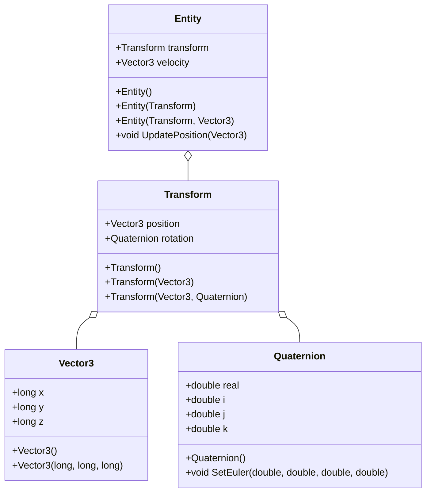

# Rigid Body Simulation

# Table of Contents

  1. Overview
  2. Table of Contents
  3. Class Diagram

# Class diagram

```mermaid
classDiagram

class Entity {
    +Transform transform
    +Vector3 velocity

    +Entity()
    +Entity(Transform)
    +Entity(Transform, Vector3)

    +void UpdatePosition(Vector3)
}

class Transform {
    +Vector3 position
    +Quaternion rotation

    +Transform()
    +Transform(Vector3)
    +Transform(Vector3, Quaternion)
}

class Vector3 {
    +long x
    +long y
    +long z

    +Vector3()
    +Vector3(long, long, long)
}

class Quaternion {
    +double real
    +double i
    +double j
    +double k

    +Quaternion()
    +void SetEuler(double, double, double, double)
}

Entity o-- Transform
Transform o-- Vector3
Transform o-- Quaternion
```
